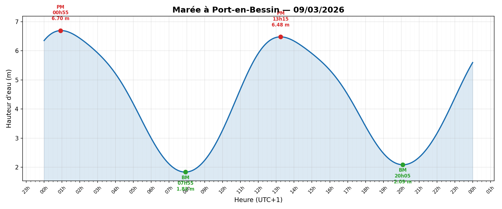
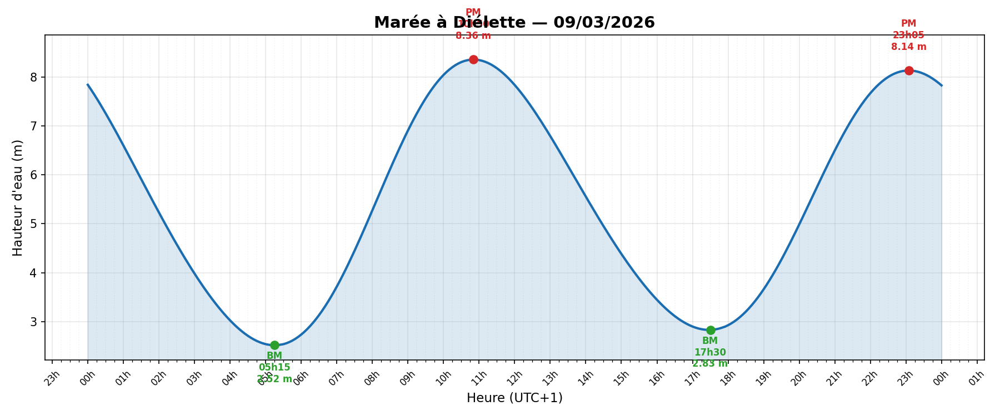

# 🌊 Marée — Prédiction de marée par méthode harmonique

Bibliothèque Python de prédiction de marée basée sur l'analyse harmonique.
Utilise les atlas SHOM/MARC et le format `.har` pour stocker les constantes
harmoniques d'un port.

<p align="center">
  
  <br><em>Port-en-Bessin — 9 mars 2026</em>
</p>

<p align="center">
  
  <br><em>Diélette — 9 mars 2026</em>
</p>

---

## Installation

```bash
git clone https://github.com/Davidlouiz/maree.git
cd maree
python -m venv .venv
source .venv/bin/activate
pip install -r requirements.txt
pip install matplotlib   # pour les graphiques
```

> **Dépendances** : `utide`, `numpy`, `netCDF4`, `scipy`, `matplotlib` (graphiques)

---

## Le format `.har`

Les constantes harmoniques d'un port sont stockées dans un fichier `.har`,
format texte lisible de type INI :

```ini
# Fichier harmonique — Port-en-Bessin
# Phases référencées à Greenwich (UTC), convention Doodson/Schureman
# Amplitude en mètres, phase en degrés
# Z0 calculé automatiquement (LAT sur 18.6 ans)

[port]
nom       = Port-en-Bessin
latitude  = 49.35
longitude = -0.75

[constituants]
# nom      amplitude(m)   phase(°)
M2           2.324588      -87.5145
S2           0.793776      -40.1051
N2           0.430588     -106.2244
...
```

Le Z0 (niveau moyen au-dessus du zéro des cartes) est calculé automatiquement
au chargement à partir des harmoniques : Z0 = −min(marée astronomique sur 18.6 ans).
C'est la définition même du zéro hydrographique (LAT = Lowest Astronomical Tide).

Deux fichiers sont fournis : `Port-en-Bessin.har` et `Dielette.har`.

---

## La bibliothèque `maree.py`

Le module principal. La classe `Maree` prédit la hauteur d'eau par somme
harmonique :

$$h(t) = Z_0 + \sum_i f_i \cdot H_i \cdot \cos(V_i + u_i - G_i)$$

où $f_i$ et $u_i$ sont les corrections nodales, $V_i$ l'argument astronomique
et $G_i$ la phase Greenwich du constituant.

### Chargement depuis un fichier `.har`

```python
from maree import Maree

m = Maree.from_har("Port-en-Bessin.har")
```

### Prédiction d'une hauteur

```python
from datetime import datetime, timezone, timedelta

dt = datetime(2026, 3, 9, 18, 20, tzinfo=timezone(timedelta(hours=1)))
h = m.hauteur(dt)
print(f"{h:.2f} m")   # 3.06 m
```

### Marées du jour (pleines & basses mers)

```python
from datetime import date

times, heights, extremes = m.maree_jour(date(2026, 3, 9), tz_offset_h=1)
```

```
=======================================================
  Marees a Port-en-Bessin — 09/03/2026
  (heures UTC+1)
=======================================================
  Pleine Mer  00h55  —  6.70 m
  Basse Mer   07h55  —  1.83 m
  Pleine Mer  13h15  —  6.48 m
  Basse Mer   20h05  —  2.09 m
=======================================================
```

### Autres sources de données

```python
# Depuis un fichier .td4 (ex: Arcachon)
m = Maree.from_td4("Arcachon.td4")

# Depuis un atlas NetCDF SHOM/MARC (Z0 calculé automatiquement)
m = Maree.from_atlas("MARC_L1-ATLAS-AHRMONIQUES/V1_MANE", lat=49.35, lon=-0.75)

# Sélection automatique du meilleur atlas
m = Maree.from_atlas_auto("MARC_L1-ATLAS-AHRMONIQUES", lat=49.35, lon=-0.75)
```

---

## Scripts

### 1. `main.py` — Exemple minimal

Prédit la hauteur d'eau à un instant donné :

```bash
python main.py
```

```
Hauteur d'eau à Port-en-Bessin le 09/03/2026 à 18h20 : 3.06 m
```

---

### 2. `plot_maree.py` — Courbe de marée journalière

Génère une image PNG de la courbe de marée avec les pleines et basses mers annotées.

```bash
python plot_maree.py Port-en-Bessin.har 2026-03-09
python plot_maree.py Dielette.har 2026-03-09 --tz 1 --output maree_dielette.png
```

| Option | Description | Défaut |
|--------|-------------|--------|
| `har` | Fichier `.har` du port | *(requis)* |
| `date` | Date au format `YYYY-MM-DD` | *(requis)* |
| `--tz` | Décalage horaire UTC | `1` (heure d'hiver) |
| `--output` | Nom du fichier image | `<port>_<date>.png` |

**Exemple de sortie :**

<p align="center">
  
</p>

---

### 3. `genere_har.py` — Génération d'un fichier `.har`

Extrait les constantes harmoniques des atlas SHOM/MARC pour une position
quelconque et génère le fichier `.har` correspondant.

Le Z0 est calculé automatiquement à partir des harmoniques extraites
(LAT = minimum astronomique sur 18.6 ans = zéro hydrographique).

```bash
python genere_har.py --nom "Port-en-Bessin" --lat 49.35 --lon -0.75
python genere_har.py --nom "Diélette" --lat 49.55 --lon -1.867 --output Dielette.har
python genere_har.py --nom "Brest" --lat 48.38 --lon -4.49 --atlas-dir MARC_L1-ATLAS-AHRMONIQUES/V1_FINIS
```

| Option | Description | Défaut |
|--------|-------------|--------|
| `--nom` | Nom du port | *(requis)* |
| `--lat` | Latitude en degrés | *(requis)* |
| `--lon` | Longitude (ouest = négatif) | *(requis)* |
| `--atlas-dir` | Répertoire atlas spécifique | Auto-détection |
| `--atlas-base` | Répertoire parent des atlas | `MARC_L1-ATLAS-AHRMONIQUES` |
| `--output` | Fichier de sortie | `<nom>.har` |

```
Recherche du meilleur atlas pour (49.350, -0.750)...
  → Atlas sélectionné : V1_MANE
Extraction des harmoniques depuis V1_MANE...
  → 37 constituants extraits
  → Point océanique : (49.3526°N, -0.7492°E)

Fichier sauvegardé : Port-en-Bessin.har
  37 constituants
  Z0 = 4.3227 m (calculé automatiquement, LAT 18.6 ans)
```

---

## Précision

Validée sur plusieurs ports contre les références [maree.info](https://maree.info) :

| Port | Source | Erreur moyenne | Erreur max |
|------|--------|:--------------:|:----------:|
| Arcachon | `.td4` (105 const.) | ± 0.11 m | ± 0.26 m |
| Brest | Atlas V1_FINIS | ± 0.04 m | ± 0.11 m |
| Port-en-Bessin | Atlas V1_MANE | — | ± 0.06 m |
| Diélette | Atlas V1_MANW | — | ± 0.14 m |
| Dahouet | Atlas V1_MANW | ± 0.17 m | ± 0.27 m |

---

## Structure du projet

```
├── maree.py            # Bibliothèque principale
├── main.py             # Exemple minimal
├── plot_maree.py       # Génération de courbes
├── genere_har.py       # Génération de fichiers .har
├── Port-en-Bessin.har  # Harmoniques Port-en-Bessin
├── Dielette.har        # Harmoniques Diélette
├── Arcachon.td4        # Données Arcachon (format td4)
├── requirements.txt    # Dépendances Python
└── images/             # Courbes de marée (PNG)
```

## Licence

Données harmoniques issues des atlas SHOM/MARC (domaine public pour usage non commercial).
